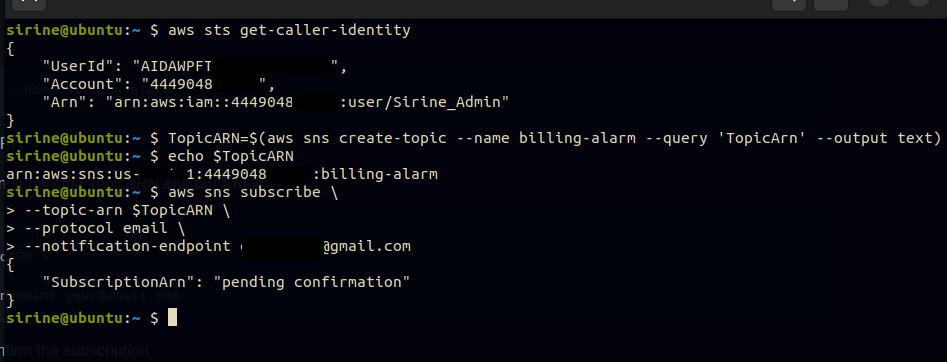
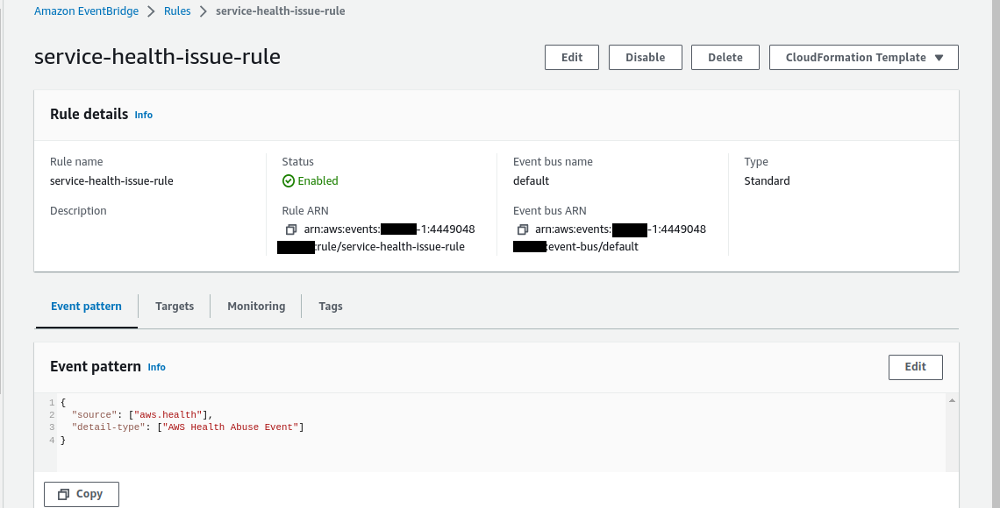

# Week 0 — Billing and Architecture

## Homework/Tasks:

### Installing aws cli:

### Using AWS CloudShell:

### Set a billing alarm:

### Set an aws budget:

### Create an admin IAM user:

### Create an IAM role:

### EventBridge rule:

### Research the technical and service limits of specific services:

### Open a support ticket and request a service limit:

### Conceptual diagram:
[conceptual_diagram](https://lucid.app/lucidchart/a5be6db5-8490-4c6f-b725-8b249f10e3c9/edit?viewport_loc=-1444%2C-602%2C3975%2C1590%2C0_0&invitationId=inv_0ee3b648-655d-4dd2-80a0-55ebba7370d7)

### Logical diagram:
[logical_diagram](https://drive.google.com/file/d/14UlVYSk0Vcg2NH6LukTg_NS7uI4D2_FF/view?usp=sharing)

