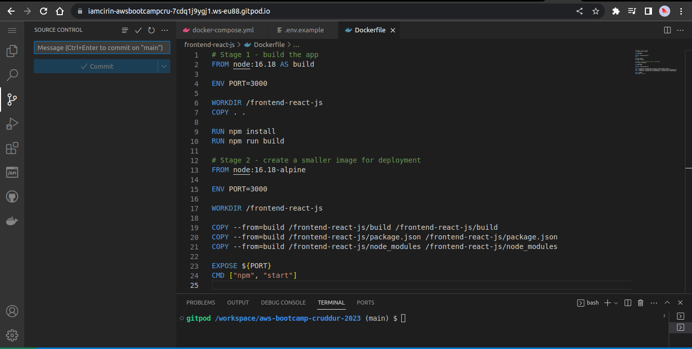

# Week 1 — App Containerization

## Run the app with docker-compose.yml file.png
remarque: the port on .env.example (backend-flask folder) was set to 3001 so I had to change it for the app to work

## Run the dockerfile CMD as an external script

## Push and tag a image to DockerHub (they have a free tier)
  - I pulled an ubuntu image from docker hub
  - ran a container from the image
  - installed git to customize it
  - committed the container to an image
  - tagged and pushed the image

## Use multi-stage building for a Dockerfile build

## Implement a healthcheck in the V3 Docker compose file

## install Docker on your localmachine and get the same containers running outside of Gitpod / Codespaces

  - pushed the images from gitpod to docker hub
  - pulled the images to my local machine
  - ran the images locally

