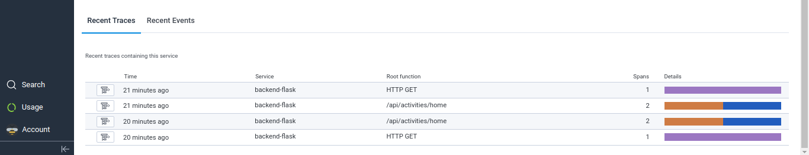
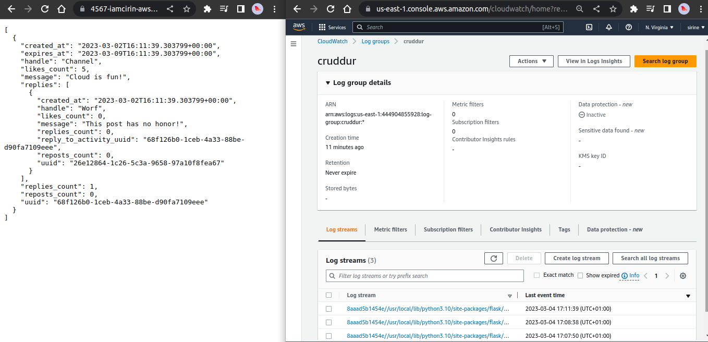
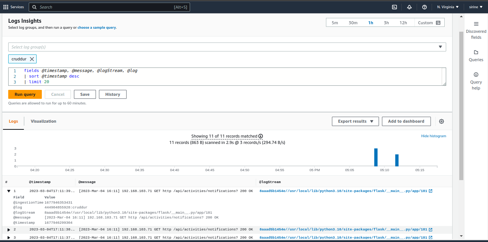
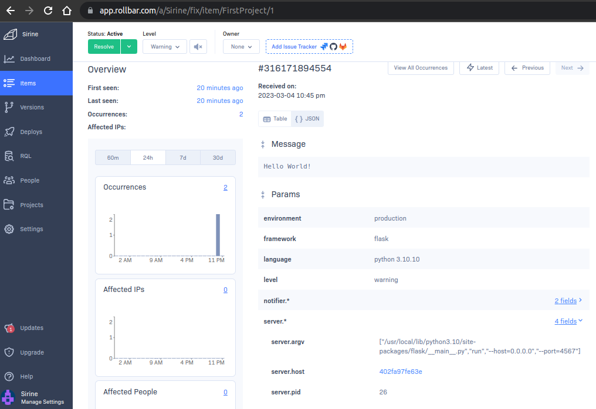
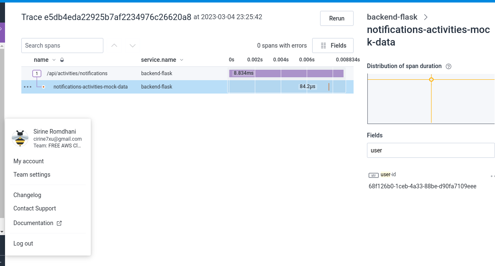

# Week 2 — Distributed Tracing

## Instrument Honeycomb with OTEL





### Add instruments to display data on console:


## Instrument AWS X-Ray

### Create x-ray group


### Create sampling-rule:


### Send data to aws x-ray:


### Configure the X-RAY segment and subsegment for "notifications-activities.py"

```
# added for x-eay segment
from aws_xray_sdk.core import xray_recorder
from aws_xray_sdk.core import patch_all
from datetime import datetime, timedelta, timezone
patch_all()


# added for x-ray segment
xray_recorder.begin_segment('notification-activities')

class NotificationsActivities:
  def run():
  # added this line for x-ray sbsegment
    with xray_recorder.in_subsegment('notification-activities-subsegment'):
      now = datetime.now(timezone.utc).astimezone()
      results = [{
        'uuid': '68f126b0-1ceb-4a33-88be-d90fa7109eee',
        'handle':  'Channel',
        'message': 'Cloud is fun!',
        'created_at': (now - timedelta(days=2)).isoformat(),
        'expires_at': (now + timedelta(days=5)).isoformat(),
        'likes_count': 5,
        'replies_count': 1,
        'reposts_count': 0,
        'replies': [{
          'uuid': '26e12864-1c26-5c3a-9658-97a10f8fea67',
          'reply_to_activity_uuid': '68f126b0-1ceb-4a33-88be-d90fa7109eee',
          'handle':  'Worf',
          'message': 'This post has no honor!',
          'likes_count': 0,
          'replies_count': 0,
          'reposts_count': 0,
          'created_at': (now - timedelta(days=2)).isoformat()
        }],
      }
      ]
      xray_recorder.put_metadata('results', len(results))
      xray_recorder.put_annotation('handle', results[0]['handle'])
      xray_recorder.end_subsegment()
      return results


xray_recorder.end_segment()
```


### Activities-notifications' trace row data:


```json
{
    "Id": "1-640358eb-2eea1239c43e50ee698d2775",
    "Duration": 0.002,
    "LimitExceeded": false,
    "Segments": [
        {
            "Id": "360c599cdf153a94",
            "Document": {
                "id": "360c599cdf153a94",
                "name": "4567-iamcirin-awsbootcampcru-6sgfhud7439.ws-eu89.gitpod.io",
                "start_time": 1677940971.414751,
                "trace_id": "1-640358eb-2eea1239c43e50ee698d2775",
                "end_time": 1677940971.4162974,
                "in_progress": false,
                "http": {
                    "request": {
                        "url": "http://4567-iamcirin-awsbootcampcru-6sgfhud7439.ws-eu89.gitpod.io/api/activities/notifications",
                        "method": "GET",
                        "user_agent": "Mozilla/5.0 (X11; Linux x86_64) AppleWebKit/537.36 (KHTML, like Gecko) Chrome/110.0.0.0 Safari/537.36",
                        "client_ip": "197.0.23.76",
                        "x_forwarded_for": true
                    },
                    "response": {
                        "status": 200,
                        "content_length": 679
                    }
                },
                "aws": {
                    "xray": {
                        "sdk_version": "2.11.0",
                        "sdk": "X-Ray for Python"
                    }
                },
                "service": {
                    "runtime": "CPython",
                    "runtime_version": "3.10.10"
                },
                "subsegments": [
                    {
                        "id": "cf56ed4791ab7b58",
                        "name": "notification-activities-subsegment",
                        "start_time": 1677940971.4153833,
                        "end_time": 1677940971.415471,
                        "in_progress": false,
                        "annotations": {
                            "handle": "Channel"
                        },
                        "metadata": {
                            "default": {
                                "results": 1
                            }
                        },
                        "namespace": "local"
                    }
                ]
            }
        }
    ]
}

```

	### Configure custom logger to send to CloudWatch Logs
	
	note: implementing the code for CloudWatch Logs, through an error in the implementaion of the x-ray segment and subsegment of the "notifications-activities", for one of them to work I had to comment the code lines of the other.





### implementing rollbar:



## Challenge Homework:

### Add custom instrumentation to Honeycomb to add more attributes eg. UserId, Add a custom span

- I created a notifications-activities-mock-data span
- added 2 attributes (user-id, handle)



