# Week 2 — Distributed Tracing

## Instrument Honeycomb with OTEL

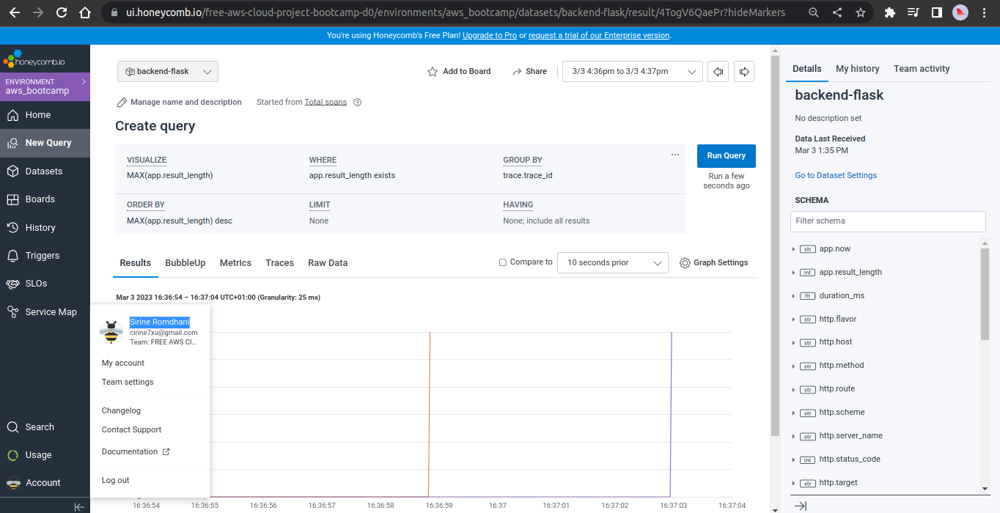

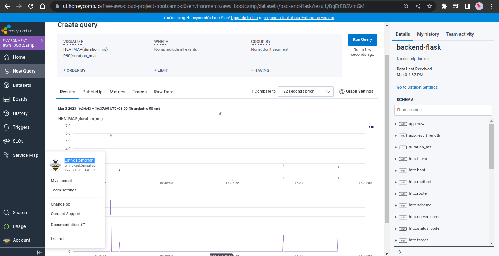

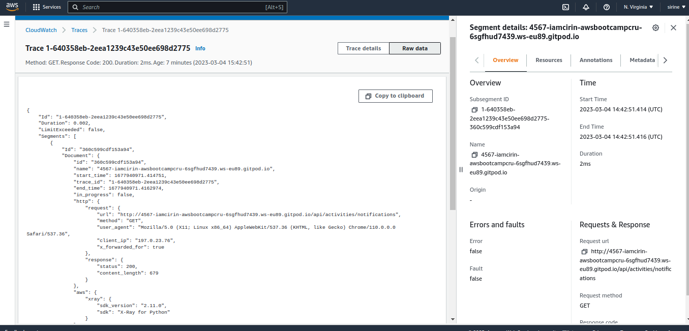

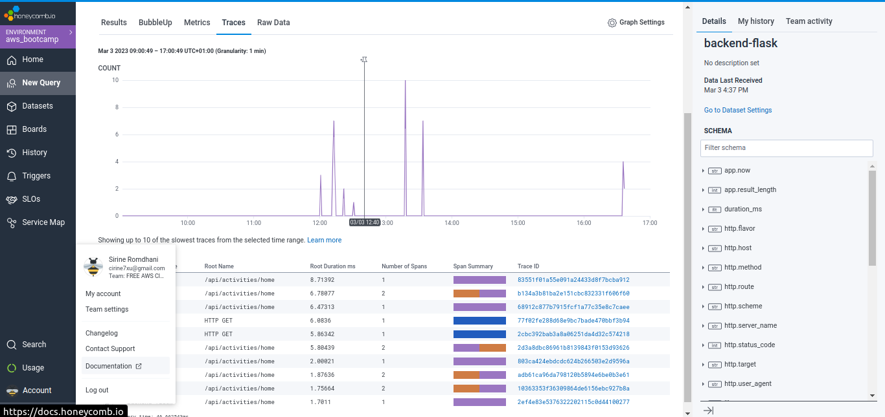

### Add instruments to display day on console:

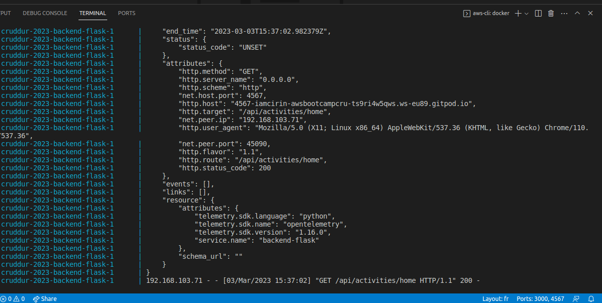

## Instrument AWS X-Ray

### Create x-ray group

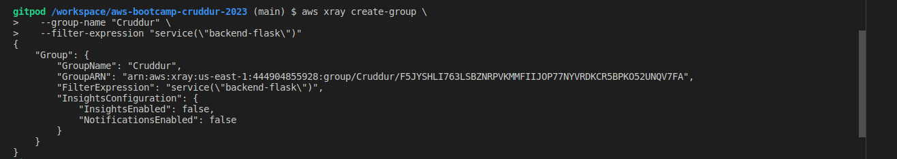

### Create sampling-rule:

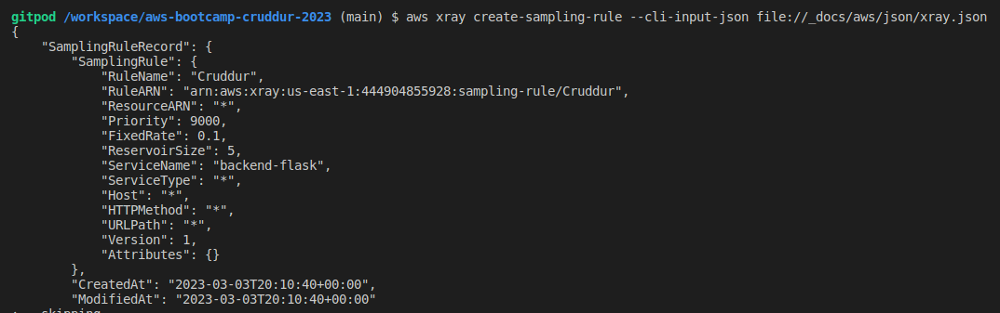

### Send data to aws x-ray:

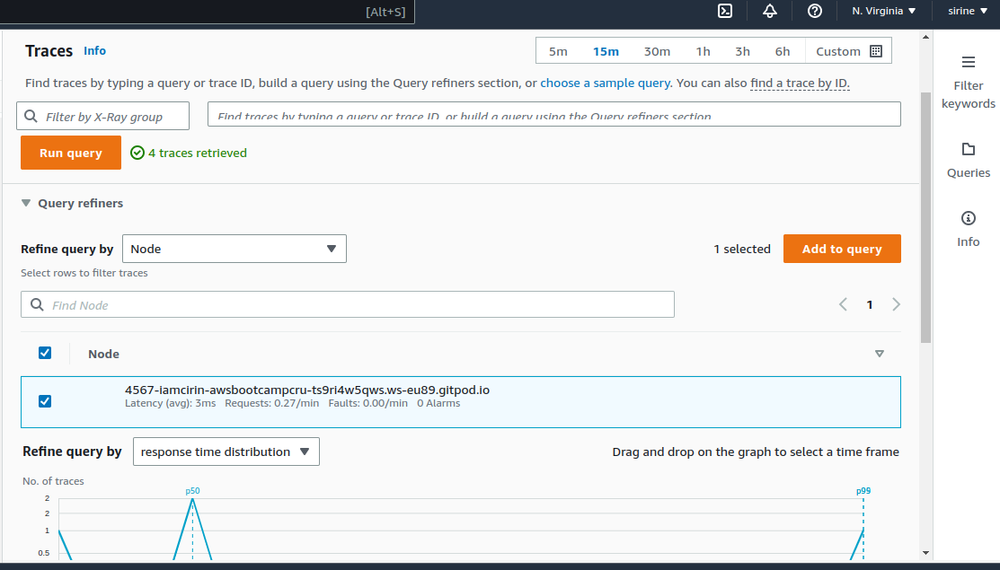

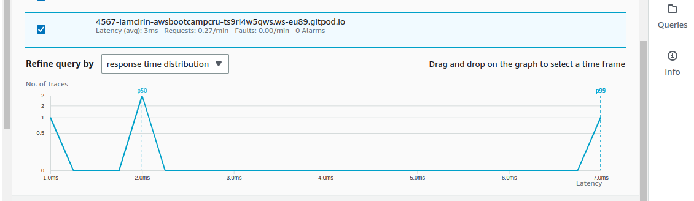

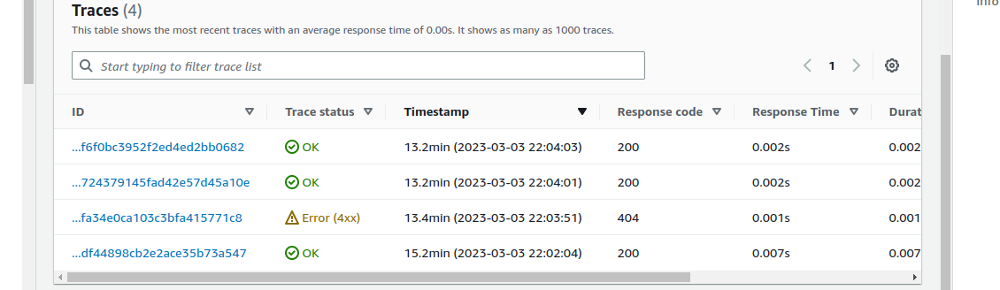

### Configure the X-RAY segment and subsegment for "notifications-activities.py"

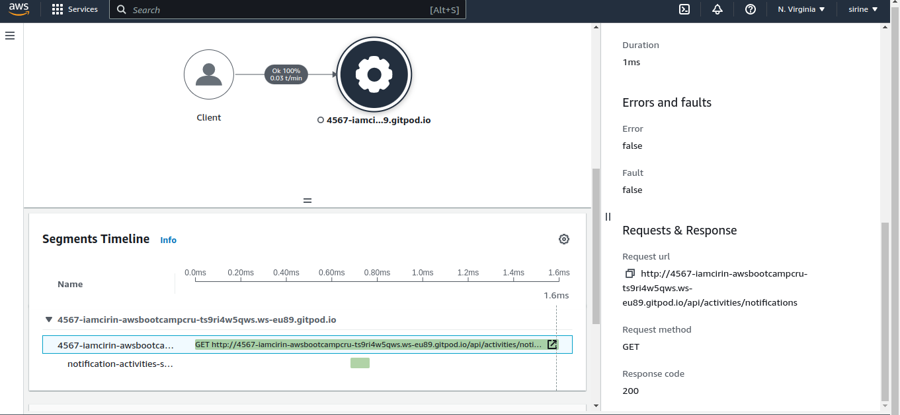

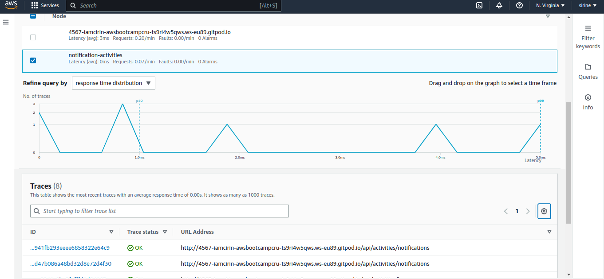

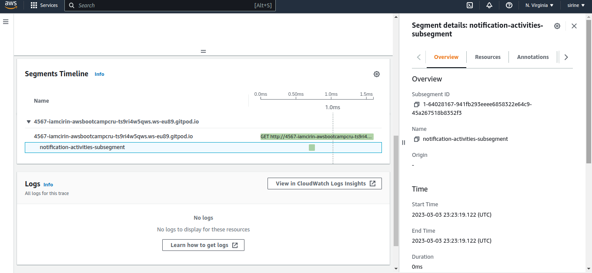

