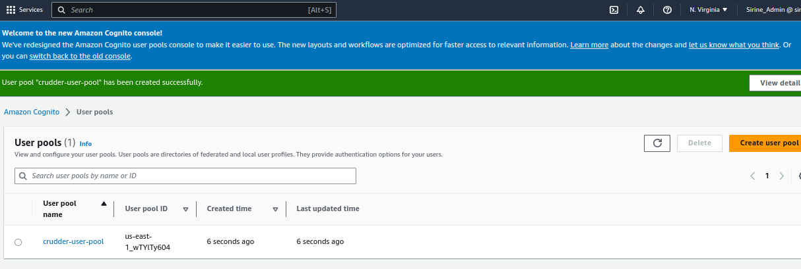
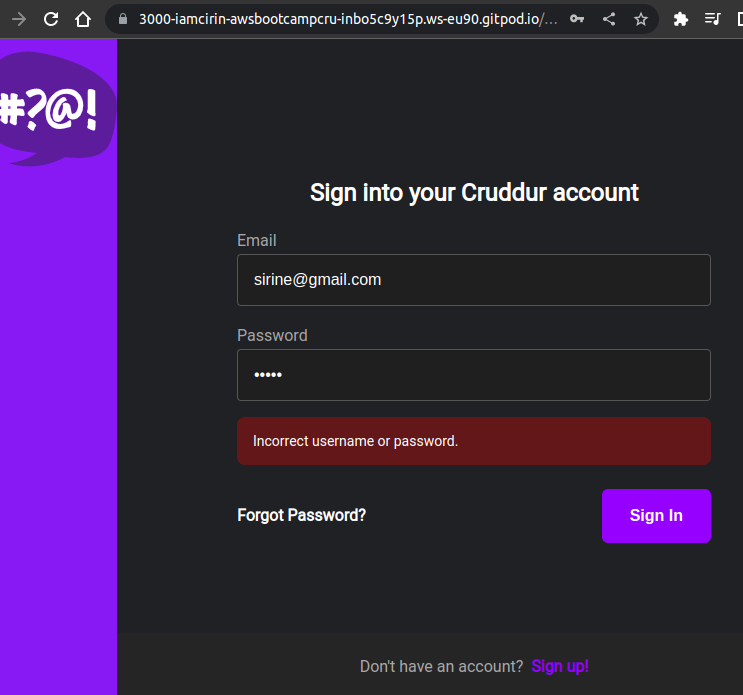
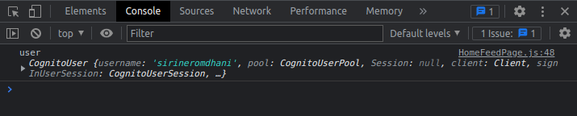
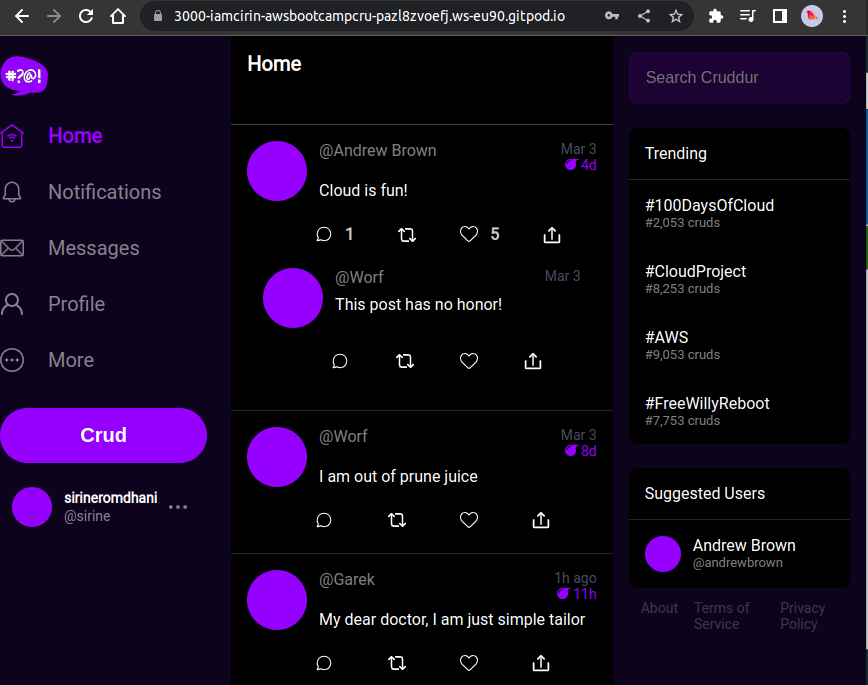
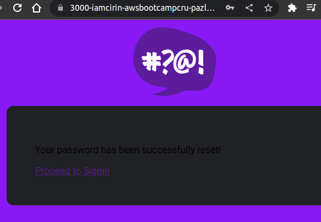
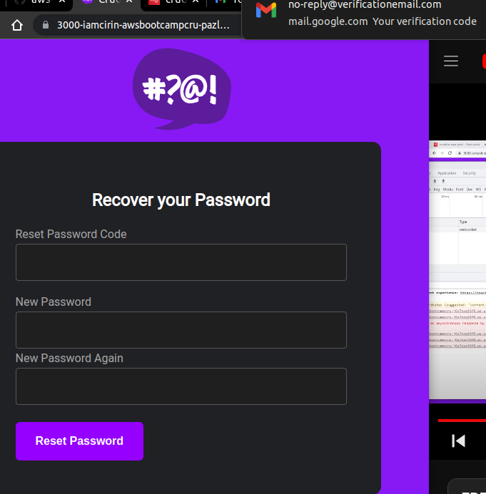
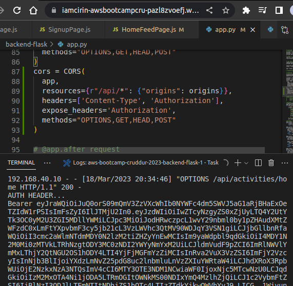
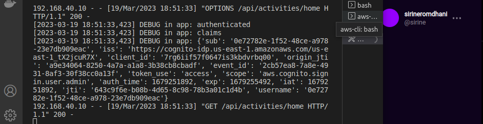

# Week 3 — Decentralized Authentication

## Setup Cognito User Pool

## Implement Custom Signin Page

## Implement Custom Confirmation Page

## Implement Custom Recovery Page

## Verify JWT token server side

